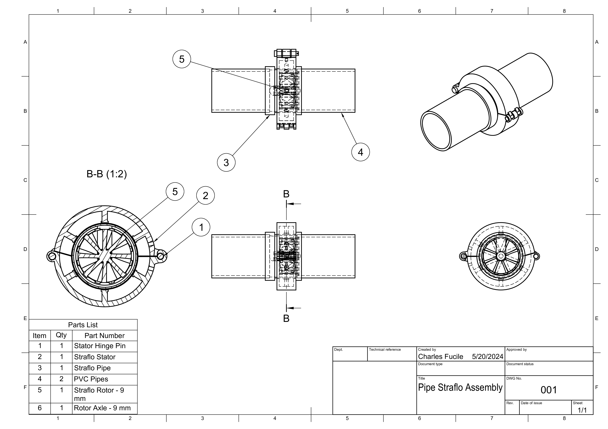
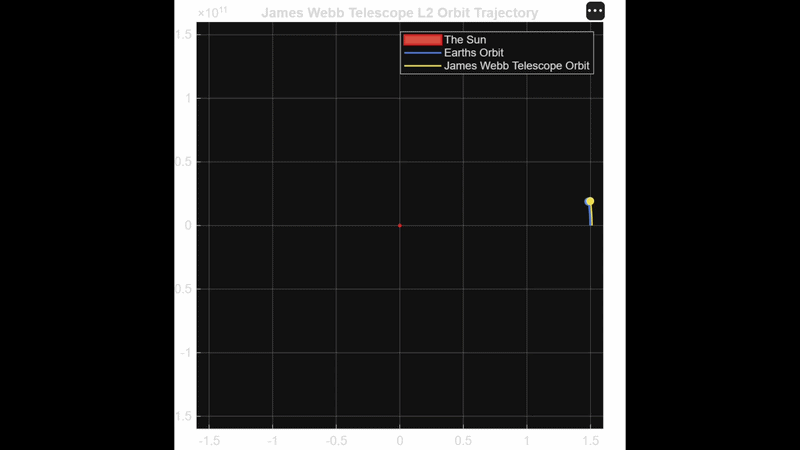
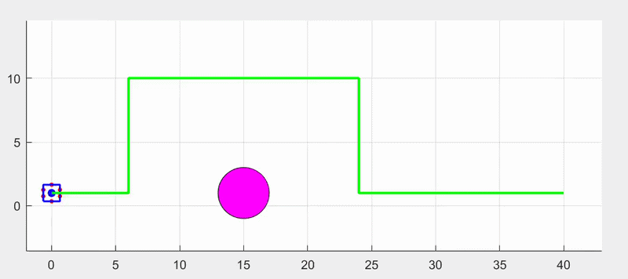
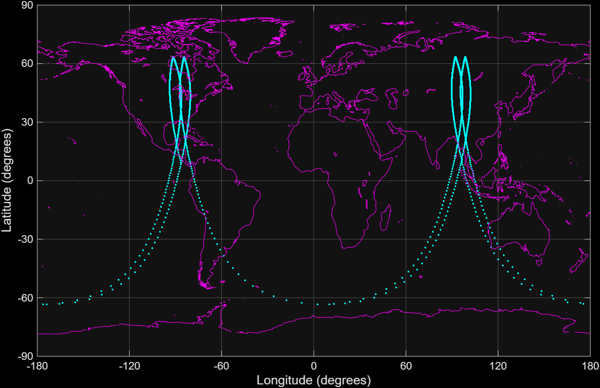
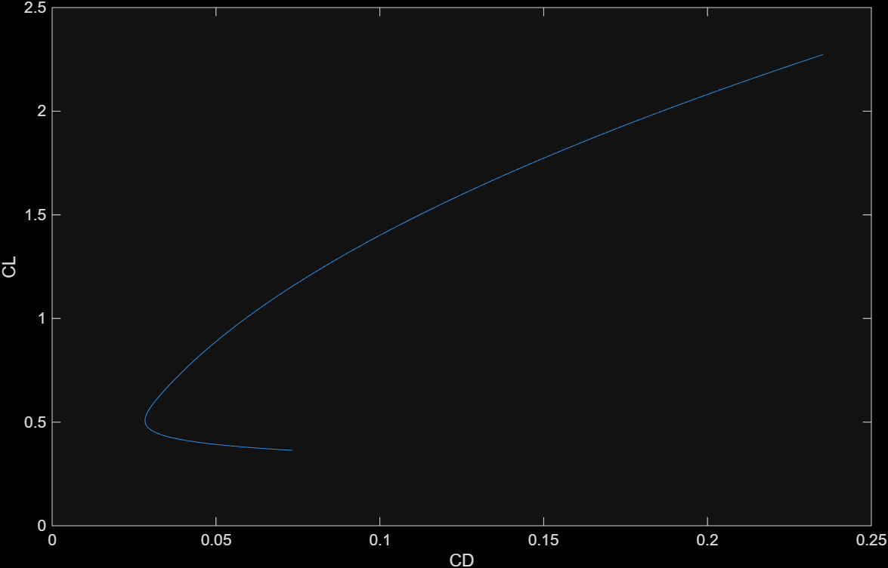

# Individual Projects

### High School Science Fair – Micro‑Hydroelectric Turbine
_Overview_
Pursued a micro-hydroelectric turbine which would be installed in household pipes to passively generate electricity through household water use. Developed 10+ prototypes, met with professors and teachers to determine fluid mechanics. Calculated theoretical energy output of the turbine and conducted tests to try and determine real electrical output.

**Key Visuals**  

**What I Learned**
- How to design and test a physical system  
- Basics of fluid flow and energy extraction  
- How to troubleshoot when nothing works the first time

#### Research Paper

<embed src="/papers/stockholm_turbine.pdf"
       width="100%"
       height="800px"
       type="application/pdf">

# School Projects

### Dynamics – Orbital Mechanics Simulation (L2 Point)
_Overview_  
This project simulates the orbital motion of a satellite around the Sun near the L2 point. The goal was to estimate the L2 location using orbital mechanics relations, then simulate motion around it using numerical integration.

_Methodology_
* Started with basic Euler approximations to get a feel for orbital propagation  
* Moved into more stable numerical methods once the system started behaving    
* Simulated trajectories in the rotating frame  
* Visualized the motion to confirm expected L2 behavior
* Modeled the restricted 3‑body problem (Earth–Sun) 

**Key Visuals**

**Code Snippet**
~~~matlab
% Force components (gravity)
Fx(i) = -G*Me*m * x(i) / (x(i)^2 + y(i)^2)^(1.5);
Fy(i) = -G*Me*m * y(i) / (x(i)^2 + y(i)^2)^(1.5);

% Euler integration
vx(i+1) = vx(i) + Fx(i)/m * dt;
vy(i+1) = vy(i) + Fy(i)/m * dt;

x(i+1) = x(i) + vx(i) * dt;
y(i+1) = y(i) + vy(i) * dt;
~~~

### Dynamics – Robotic Motion Simulation
_Overview_  
This project focused on simulating the motion of a simple cube robit using basic dynamics and numerical integration. The goal was to understand how the possible motion of a robot in a microgravity environment by designing and simulating a robot based on the AstroBee. The robot design my team pursued had offset sets of two thrusters on two of its 6 faces so that it could adjust its orientation and thrust.

_Methodology_
* Designed the robot thruster geometry
* Used the thruster force and offset to determine their moments  
* Determined the inputs needed to navigate around an obstacle  
* Simulated the robot's motion around an obstacle

**Key Visuals**

**Code Snippet**
~~~matlab
F_tx = -1 * thrDir(:,1) .* T;
F_ty = -1 * thrDir(:, 2) .* T;

tcomp1 = (thrRel(1,1)*F_ty(1) - thrRel(1,2)*F_tx(1));
tcomp2 = (thrRel(2,1)*F_ty(2) - thrRel(2,2)*F_tx(2));
tcomp3 = (thrRel(3,1)*F_ty(3) - thrRel(3,2)*F_tx(3));
tcomp4 = (thrRel(4,1)*F_ty(4) - thrRel(4,2)*F_tx(4));

torq = sum(max(([tcomp1,tcomp2,tcomp3,tcomp4]),0))';
rot_a = torq / I_zz;

omega(r) = omega(r-1) + rot_a * dt;
theta(r:numFrames) = theta(r-1) + omega(r) * dt;
~~~

### Vehicle Performance – Satellite Ground Tracking
_Overview_  
This project simulated the ground track of a satellite orbiting Earth. The goal was to understand how orbital parameters translate into what you actually see on the ground. The simulation was conducted for a period of two days as well to understand how orbital paths shift as the Earth rotates.

_Methodology_
* Modeled perifocal two‑body motion
* Converted to the Earth centered coordinate system
* Converted orbital position to latitude/longitude  
* Generated ground track plots

**Key Visuals**

**Code Snippet**
~~~matlab
x_pred = x(i) + deltat*uNow;
y_pred = y(i) + deltat*vNow;
r_pred = sqrt(x(i)^2+y(i)^2);

u_pred = uNow + deltat*(-r_pred^-3)*x(i);
v_pred = vNow + deltat*(-r_pred^-3)*y(i);

xCorr = (x(i) + x_pred)/2 + deltat/2 * u_pred;
yCorr = (y(i) + y_pred)/2 + deltat/2 * v_pred;

rCorr = sqrt(x_pred^2+y_pred^2);
uCorr = (uNow+u_pred)/2 + deltat/2 * (-rCorr^-3) * x_pred;
vCorr = (vNow+v_pred)/2 + deltat/2 * (-rCorr^-3) * y_pred;

x(i+1) = xCorr;
y(i+1) = yCorr;
uNow = uCorr;
vNow = vCorr;
~~~

### Vehicle Performance – Aircraft Range & Service Ceiling Calculations
_Overview_  
This project involved calculating aircraft range, drag polar, and service ceiling using standard performance equations. It tied together aerodynamic concepts with real‑world performance metrics.

_Methodology_
* Modeled drag polar
* Calculated range using drag polar 
* Calculated service ceiling using excess power curves  

**Key Visuals**

**Code Snippet**
~~~matlab
% Induced Drag
e = 0.95;
K = 1./(pi.*e.*wing(6));
indDrag = K.*CL.^2;

% Wave Drag
machDD = (0.95 - CL./(10.*cos(wing(9))^2) - wing(10)./cos(wing(9)))./cos(wing(9));
machCr = machDD - (0.1./80)^(1/3);
wavDrag = 20.*max(0,(mach-machCr)).^4;

% Total Drag
totalCD = parDrag + indDrag + wavDrag;
~~~
