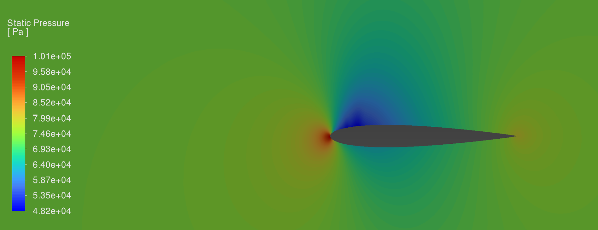
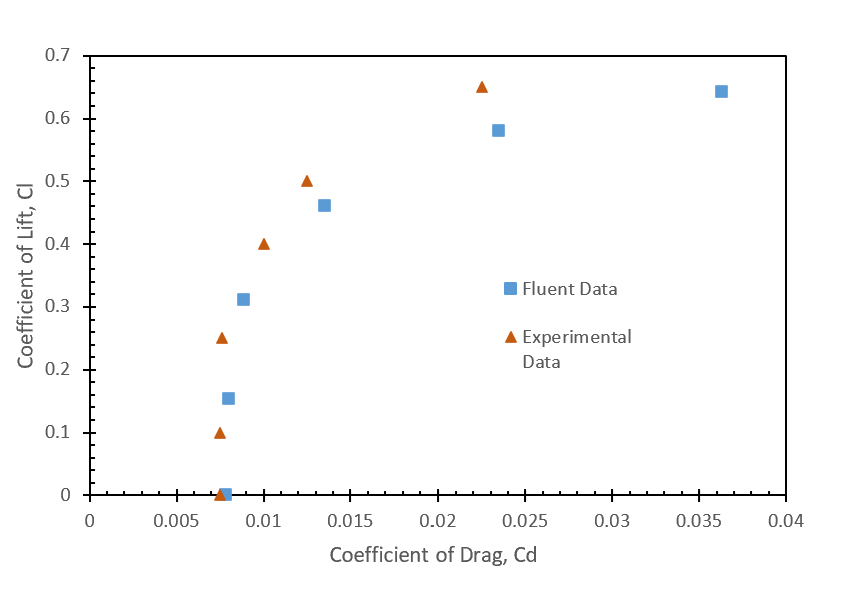
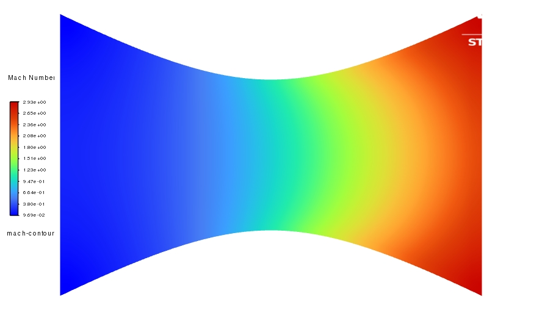
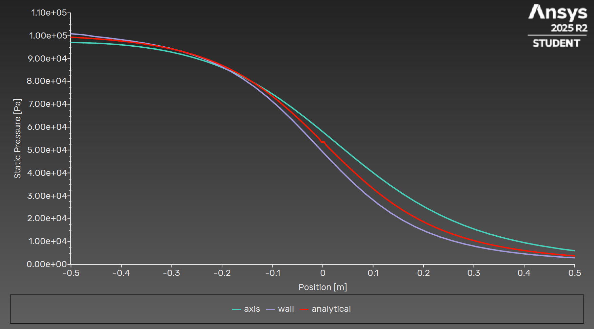
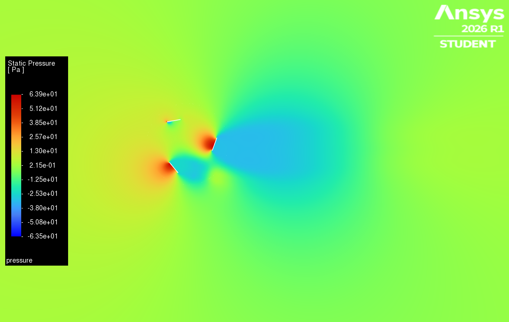
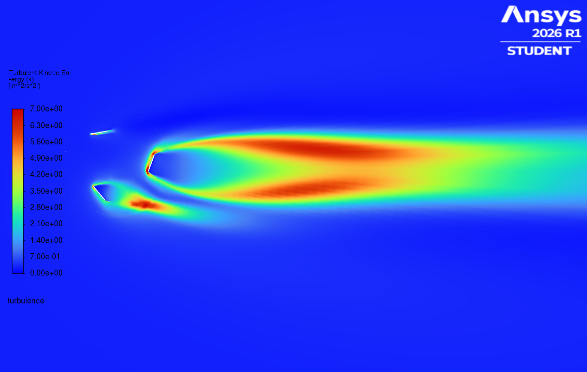

# Computational Fluid Dynamics Research @ Georgia Tech

Highlights:
- 7 geometries modeled and analyzed on ANSYS Fluent
- Determmined pressure and velocity profiles across wings and airfoils
- Experience with mesh creation, setup troubleshooting, and results analysis

## CFD Analysis of Symmetric Airfoil w/ Parametric Sweep of AoA
Case study of the aerodynamic behavior of a NACA0012 airfoil at an airspeed of Mach 0.7. The flow was computed at angles of attack of 0, 1, 2, 3, 4, & 5. With the objective of understanding the relationship between change in angle of attack and change in flow behavior.

_Methodology_
* Geometry: NACA 0012
* Solver: SST k-omega
* Mesh: 36800 cells
* Boundary Conditions: Inlet Mach - 0.7  Inlet Pressure - 1000 Pa
* Assumptions: steady, inviscid, and incompressible

_Results_
The pressure and mach distributions over the airfoil demonstrate the principles of lift as well as the propagation of the boundary layer along the surface. This case study was conducted in order to verify the use of CFD simulations to represent systems, by representing a system which we know the results of for comparison. Additionally, this study was compared to experimental data in order to determine the accuracy of Fluent simulation and was determined to be within an acceptable parameter of experimental data to be considered valid.

## CFD Analysis of Axisymmetric Nozzle
Case study of the aerodynamic behavior of an axisymmetric nozzle. 

_Methodology_
* Geometry: Axisymmetric nozzle (A=x^2+0.1; -0.5<x<0.5)
* Mesh: 533 cells
* Boundary Conditions: Reservoir Pressure - 101325 Pa  Reservoir Temperature - 300 K
* Assumptions: unsteady, inviscid, and compressible

_Results_
The study conducted for this geometry demonstrated a difference between our simulated and expected results, however this was due to the assumptions of many nozzle calculations to average values across the nozzle's area. Comparing the pressure at different walls of the nozzle we found that the expected pressure was right between these values throughout the nozzle.

## CFD Analysis of Vertical Axis Wind Turbine
Case study of the aerodynamic behavior of a vertical axis wind turbine using a rotating frame of motion. The flow over the blades was computed to determine the behavior of the rotor blades at different points in their rotation.

_Methodology_
* Solver: k-epsilon Realizable
* Mesh: 42491 cells
* Boundary Conditions: Inlet Velocity - 10 m/s  Inlet Pressure - 40 rpm
* Assumptions: steady, viscous, no-slip, and incompressible

_Results_
The velocity and kinetic energy shown trailing the rotor blades demonstrated the transfer of energy from the flow to the rotor as the simulation occurred. Additionally, the difference between the rotor reactions at different angles clearly demonstrated the orientation of the rotor blades which results in the greatest impact on energy production.
